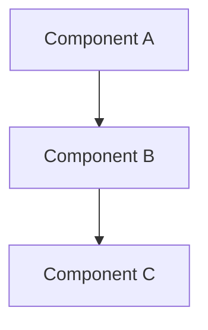

# Задача

Тебе необходимо исследовать существующий программный проект и создать для него полноценную документацию.

Главная цель — не пересказать содержимое исходного кода, а восстановить модель проекта: зачем он существует, что он делает, из каких концепций и механизмов состоит, как устроена его архитектура, как это реализовано и как проект запускать, тестировать и развивать.

Документация должна быть полезна одновременно:

* человеку, который впервые знакомится с проектом;
* разработчику, который начинает работать с кодом;
* разработчику, который хочет изменить существующую механику;
* ИИ-агенту, которому в будущем потребуется понимать и изменять проект.

---

# Главный принцип

Разделяй следующие уровни описания:

**Зачем → Что → Из чего → Как → Как использовать**

Не смешивай их.

Например:

* «Агент получает энергию за взаимодействие» — доменный уровень.
* «InteractionSystem отвечает за проведение взаимодействий» — архитектурный уровень.
* `InteractionSystem.resolve()` — кодовый уровень.
* «Для запуска нужно выполнить `docker compose up`» — операционный уровень.

---

# Этап 1. Исследование проекта

Перед написанием документации тщательно изучи проект.

Исследуй как минимум:

1. структуру репозитория;
2. README и существующую документацию;
3. конфигурационные файлы;
4. исходный код;
5. тесты;
6. схемы данных;
7. API;
8. зависимости;
9. Docker / CI / deployment-конфигурацию, если они есть;
10. frontend и backend, если проект состоит из нескольких частей;
11. скрипты запуска, сборки и разработки;
12. примеры конфигурации;
13. миграции;
14. комментарии в коде;
15. TODO/FIXME и другие явные незавершённые места.

Не ограничивайся названиями файлов. Прослеживай реальные потоки данных и вызовов.

Если возможно, запусти проект и тесты.

---

# Этап 2. Реконструкция модели проекта

До создания финальной документации сформируй внутреннюю модель:

### Концепция

* какую проблему решает проект;
* зачем он существует;
* основная идея;
* цели;
* ограничения;
* что проект намеренно НЕ пытается делать.

### Домен

Определи:

* основные сущности;
* состояния;
* события;
* процессы;
* взаимодействия;
* правила;
* инварианты;
* алгоритмы;
* причинно-следственные связи.

Особенно внимательно отделяй доменные правила от технической реализации.

### Архитектура

Определи:

* основные компоненты;
* ответственность каждого компонента;
* зависимости;
* границы модулей;
* потоки данных;
* точки взаимодействия;
* внешние системы;
* ключевые интерфейсы.

### Реализация

Определи:

* где реализованы основные механизмы;
* какие модули, классы, структуры и функции являются ключевыми;
* какие технические решения используются;
* какие ограничения накладывает текущая реализация.

### Операционная часть

Определи:

* как установить проект;
* как запустить;
* как запустить development-режим;
* как запустить тесты;
* как собрать;
* как настроить;
* как развернуть;
* как диагностировать типовые проблемы.

---

# Этап 3. Создание документации

Создай документацию в следующей структуре:

```text
docs/
├── 01-concept/
│   ├── vision.md
│   ├── goals.md
│   └── research-questions.md
│
├── 02-domain/
│   ├── overview.md
│   ├── entities.md
│   ├── mechanics.md
│   ├── algorithms.md
│   └── rules.md
│
├── 03-architecture/
│   ├── overview.md
│   ├── components.md
│   ├── data-flow.md
│   └── integrations.md
│
├── 04-code/
│   ├── structure.md
│   ├── modules.md
│   └── implementation.md
│
├── 05-operations/
│   ├── setup.md
│   ├── development.md
│   ├── testing.md
│   └── deployment.md
│
├── 06-experiments/
│   └── README.md
│
└── 07-decisions/
    └── README.md
```

Если какая-либо категория неприменима к проекту, не создавай фиктивное содержимое. Вместо этого явно укажи, что соответствующий раздел пока отсутствует или неприменим.

Если существующая структура проекта уже содержит хорошую систему документации, не разрушай её без необходимости. Адаптируй предложенную структуру к существующей.

---

# Требования к содержанию

## 1. Concept

Документ должен отвечать на вопросы:

* Что это за проект?
* Зачем он существует?
* Какую проблему решает?
* Какова его основная идея?
* Каковы цели?
* Какие задачи входят в область проекта?
* Какие задачи НЕ входят в область проекта?
* Какие предположения лежат в основе проекта?

Не придумывай цели, которых нет в проекте.

Если назначение проекта нельзя достоверно определить из кода и существующих материалов, явно пометь это как неопределённость.

---

## 2. Domain

Документируй проект как модель предметной области, независимо от конкретного языка программирования.

Например:

ПЛОХО:

> `AgentManager` вызывает `agent.update_energy()` после `InteractionService.process()`.

ХОРОШО:

> После завершения взаимодействия агент получает или теряет энергию в соответствии с результатом взаимодействия.

На доменном уровне не используй названия классов и файлов, если они не необходимы для понимания.

Опиши:

* сущности;
* их свойства;
* состояния;
* переходы состояний;
* события;
* механики;
* правила;
* ограничения;
* алгоритмы;
* инварианты.

Если существуют математические правила или формулы — документируй их явно.

---

## 3. Architecture

Покажи, как доменная модель реализуется системой.

Для каждого крупного компонента укажи:

* назначение;
* ответственность;
* входные данные;
* выходные данные;
* зависимости;
* с какими компонентами взаимодействует.

По возможности добавляй Mermaid-диаграммы.

Например:



Диаграммы должны отражать реальную архитектуру, а не предполагаемую.

---

## 4. Code

Здесь уже можно подробно говорить о реализации.

Документируй:

* структуру каталогов;
* ключевые модули;
* ключевые классы / структуры;
* публичные интерфейсы;
* важные функции;
* зависимости между модулями;
* важные технические решения;
* особенности реализации.

Не нужно описывать каждую функцию проекта.

Документируй прежде всего то, что необходимо разработчику для понимания и изменения системы.

Не дублируй очевидный код.

---

## 5. Operations

Документ должен позволять новому разработчику самостоятельно начать работать с проектом.

Опиши:

### Installation

Как установить зависимости.

### Configuration

Какие настройки существуют и где они задаются.

### Running

Как запустить проект.

### Development

Как работать с проектом локально.

### Testing

Как запускать тесты и какие типы тестов существуют.

### Build

Как собрать проект.

### Deployment

Как проект разворачивается, если deployment предусмотрен.

### Troubleshooting

Типовые проблемы и способы диагностики.

Все команды проверяй по существующим конфигурациям и скриптам проекта.

Не придумывай команды.

---

# 6. Experiments

Если проект является исследовательским, симуляционным или экспериментальным, создай отдельный раздел для экспериментов.

Документация эксперимента должна позволять воспроизвести его.

Используй структуру:

```text
Experiment:
Hypothesis:
Purpose:
Parameters:
Environment:
Procedure:
Observed results:
Interpretation:
Limitations:
```

Не выдавай интерпретацию за наблюдаемый факт.

---

# 7. Decisions

Создай раздел для архитектурных и концептуальных решений.

Если из истории проекта, существующей документации, комментариев или git history можно восстановить причины решений — документируй их.

Формат:

```text
# Decision: <название>

## Context

Почему возникла необходимость принять решение.

## Alternatives

Какие варианты рассматривались.

## Decision

Что было выбрано.

## Reason

Почему был выбран этот вариант.

## Consequences

Какие последствия это имеет.
```

Не придумывай причины решений.

Если причина неизвестна, напиши:

> Причина решения не установлена по доступным материалам.

---

# Особенно важно: факты против предположений

Не заполняй пробелы фантазией.

Используй следующие категории:

* **Fact** — непосредственно подтверждается кодом или документацией.
* **Inference** — логически следует из нескольких подтверждённых фактов.
* **Unknown** — информации недостаточно.
* **TODO** — вопрос требует решения или уточнения.

Если ты предполагаешь что-либо, явно обозначь это.

---

# Обнаруженные проблемы

Во время исследования создай отдельный файл:

```text
docs/REVIEW.md
```

Туда заноси:

* противоречия между документацией и кодом;
* неясные места;
* мёртвый код;
* подозрительные зависимости;
* отсутствующие тесты;
* потенциальные архитектурные проблемы;
* TODO;
* места, где невозможно достоверно восстановить намерение автора.

Но:

**не исправляй код и не меняй архитектуру только потому, что обнаружил проблему.**

Твоя задача на этом этапе — документировать существующее состояние.

---

# Правило соответствия коду

Документация должна отражать **текущее состояние проекта**.

Если документация говорит одно, а код делает другое:

1. считай код источником истины для описания фактического поведения;
2. зафиксируй расхождение в `REVIEW.md`;
3. не скрывай конфликт.

Не переписывай документацию так, чтобы замаскировать проблему.

---

# Качество документации

Документация должна обладать следующими свойствами:

### Независимость уровней

Читатель должен иметь возможность прочитать только Concept и Domain, не погружаясь в код.

### Трассируемость

По возможности должно быть возможно пройти путь:

```text
Concept
   ↓
Domain
   ↓
Architecture
   ↓
Code
```

То есть от идеи проекта до конкретной реализации.

### Минимум дублирования

Не копируй одну и ту же информацию во все документы.

Каждый факт должен иметь наиболее подходящее место.

### Актуальность

Документация должна описывать существующий проект, а не идеальную будущую архитектуру.

### Практичность

Разработчик должен иметь возможность, прочитав документацию, понять:

* что делает проект;
* как он устроен;
* где искать нужную логику;
* как изменить конкретную механику;
* как запустить и проверить изменения.

---

# Финальная проверка

После создания документации проведи самостоятельный аудит.

Проверь:

1. Есть ли описание назначения проекта?
2. Понятна ли доменная модель человеку без знания кода?
3. Описаны ли ключевые механики?
4. Понятна ли архитектура?
5. Можно ли найти реализацию ключевых механизмов в коде?
6. Можно ли установить и запустить проект по документации?
7. Можно ли запустить тесты?
8. Зафиксированы ли важные неизвестные места?
9. Не перепутаны ли факты с предположениями?
10. Нет ли противоречий между документацией и кодом?
11. Не содержит ли документация выдуманных возможностей?
12. Не смешаны ли концептуальный, доменный, архитектурный и кодовый уровни?

После аудита исправь найденные проблемы в документации.

---

# Итог

В конце создай:

```text
docs/README.md
```

Это главная точка входа в документацию.

Она должна кратко объяснять:

* что это за проект;
* где находится каждый слой документации;
* с чего читать документацию новичку;
* куда идти разработчику;
* где находятся эксперименты;
* где находятся архитектурные решения;
* где находятся известные проблемы.

Не превращай `docs/README.md` в большое описание проекта. Это именно навигация.

---

# Ограничения

1. Не изменяй исходный код.
2. Не меняй архитектуру.
3. Не исправляй найденные проблемы.
4. Не придумывай отсутствующие требования.
5. Не придумывай причины архитектурных решений.
6. Не описывай предполагаемое будущее состояние как существующее.
7. Не дублируй код без необходимости.
8. Не скрывай неопределённость.
9. Не создавай документацию ради количества файлов.
10. Если существующая документация содержит полезную информацию — сохрани её и интегрируй, а не переписывай механически.

Главный критерий успеха:

**После твоей работы человек должен получить не набор пересказов файлов, а связную модель проекта — от его замысла до конкретной реализации и способов эксплуатации.**
