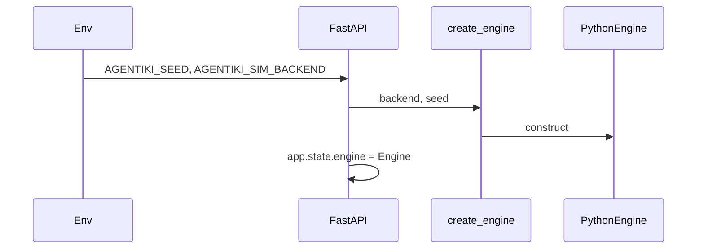
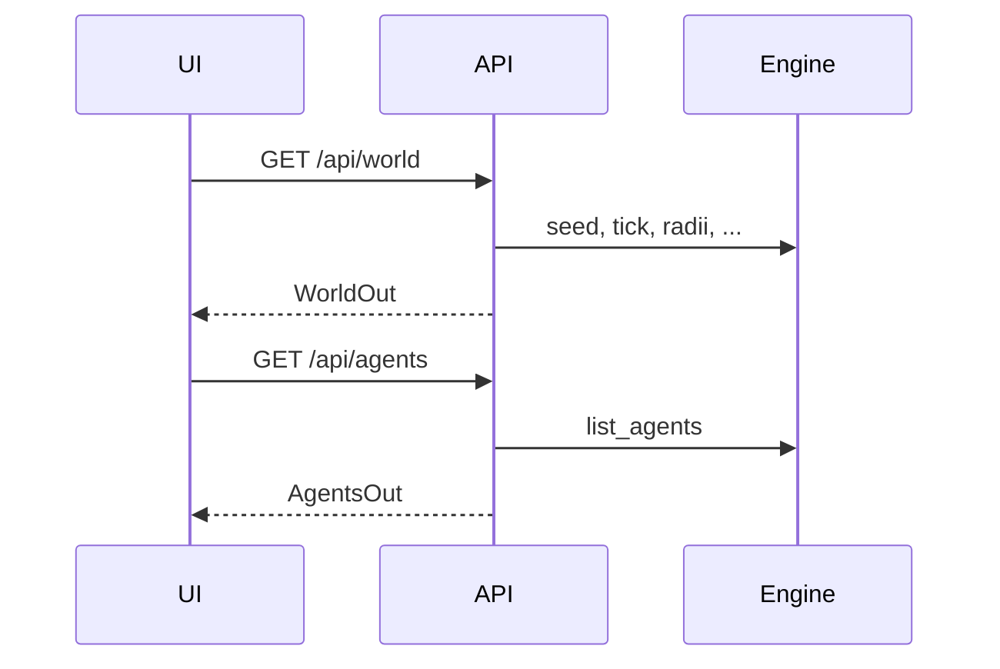
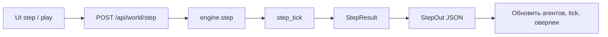

# Потоки данных

## Старт



## Bootstrap UI



## Генерация агентов

```text
UI POST /api/agents/generate {count, density}
  → engine.generate_agents(...)
    → AgentPopulation.clear + взвешенная выборка по диску + place
  → AgentsOut
UI обновляет tick через GET /api/world
```

## Step (вручную или play-интервал)



Внутри `step_tick` (концептуально):

```text
СВОБОДНЫЕ агенты: observe → strategy.choose
interact intents → resolve_interactions → создать встречи
move intents → resolve_moves → apply_positions
продолжающиеся встречи → раунд PD
новые встречи → раунд PD
вернуть StepResult
```

## Debug observation (отладка)

```text
UI выбирает агента
  → GET /api/agents/{id}/observation
  → engine.observe
  → ObservationOut
UI рисует оверлеи зрения / взаимодействия
```

## Путь клиентской отрисовки

```text
camera + cellPx
  → видимый AABB мира
  → renderGrid (локальный хеш ячейки / единый цвет)
  → renderAgents (анимированные позиции)
  → renderVisionDebug (если выбран агент)
  → renderInteractions (импульсы последнего step)
```

Авторитет симуляции остаётся на сервере; клиент только интерполирует движение для отображения.
