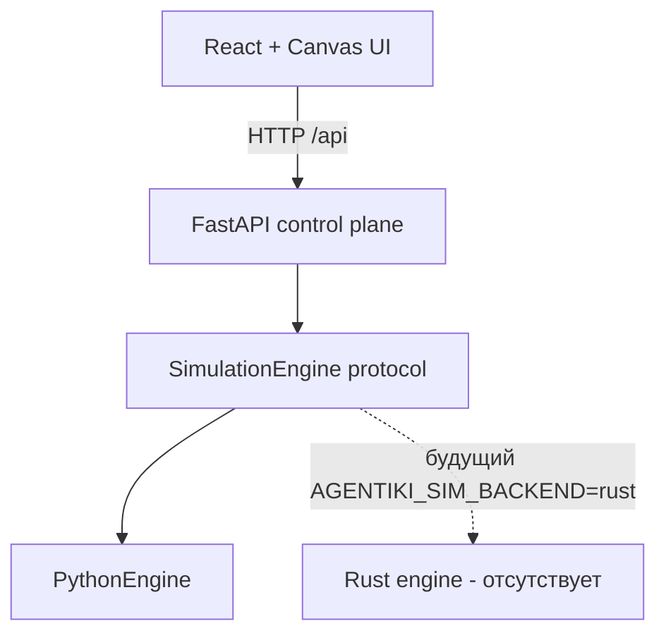

# Обзор архитектуры

## Слои

| Слой | Ответственность |
| --- | --- |
| UI (`web/`) | Камера, отрисовка, контролы, вызовы API |
| Server (`src/agentiki/server/`) | HTTP-схемы, CORS, раздача статики UI, lifecycle движка |
| Sim core (`src/agentiki/sim/`) | Мир, агенты, тик, восприятие, движение, взаимодействия, встречи, PD |

## Границы дизайна

* **Server ↔ sim:** только через `SimulationEngine` / `create_engine`.
* **UI ↔ server:** JSON по `/api/*`; в разработке Vite проксирует `/api`.
* **Камера клиента** не часть состояния симуляции.
* **Визуалы ячеек:** клиент может хешировать локально; сервер авторитетен по агентам и тику.

## Топологии runtime

### Docker (один процесс)

Multi-stage образ собирает web, затем отдаёт `web/dist` из FastAPI на порту `8000`.

### Локальная разработка (два процесса)

1. `uvicorn` на `127.0.0.1:8000`
2. Vite на `127.0.0.1:5173` с proxy API

## Поверхности конфигурации

| Источник | Что задаёт |
| --- | --- |
| `AGENTIKI_SEED` | Начальный seed мира при старте процесса |
| `AGENTIKI_SIM_BACKEND` | `python` (по умолчанию) или `rust` |
| Defaults `SimulationConfig` | Радиусы зрения/взаимодействия, матрица выплат |
| API `reset` / `generate` / `step` | Управление миром в runtime |
| Контролы UI | Камера, zoom, размер клетки, параметры generate, play/step |

## Что намеренно отложено

* Слой персистентности
* Кластеризация нескольких движков
* Auth
* CI/CD-пайплайн в репозитории
